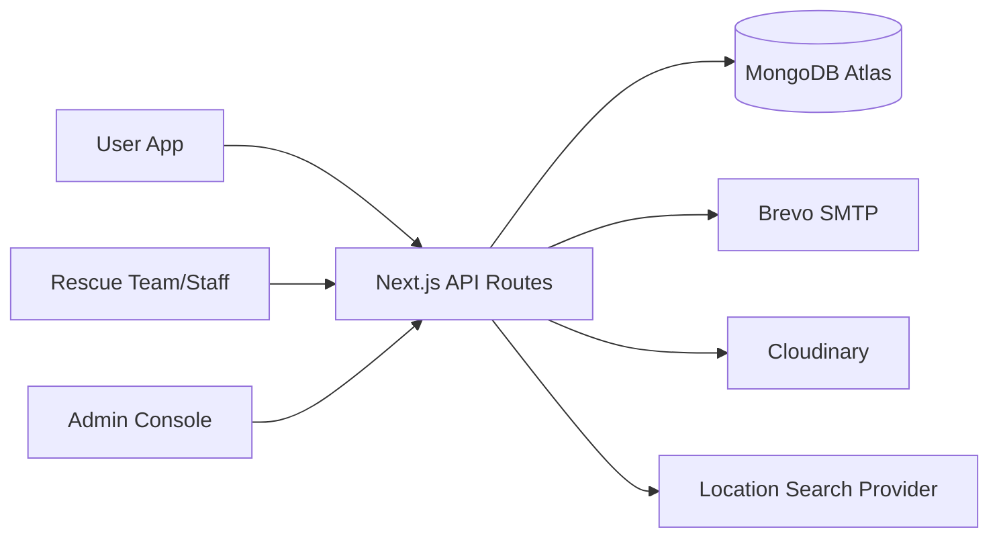

# Rescue Bird

<p align="center">
  
  
  
  
</p>

<p align="center">
  <b>Mobile-first emergency alert and rescue coordination platform for Bangladesh.</b><br />
  Built for fast incident reporting, team dispatch visibility, and role-based operations.
</p>

<p align="center">
  
  
  
</p>

## Why Rescue Bird?

- Rapid emergency alert creation with note, voice note, and location.
- Role-driven workflows for `admin`, `rescue_team`, `team_staff`, and `user`.
- Team matching by service areas plus geographic proximity.
- Live map visibility for users, teams, and admin.
- Messaging and audit trail for operational transparency.

## Tech Stack

<p>
  
</p>

- Next.js App Router + TypeScript
- MongoDB (Atlas)
- JWT cookie auth
- Brevo SMTP (OTP + greeting email)
- Cloudinary (voice-note upload)
- Leaflet map integration

## Product Roles

1. `user`: send emergency alerts and communicate with teams.
2. `rescue_team`: manage coverage zones, respond to incidents, coordinate.
3. `team_staff`: assist team operations and messaging.
4. `admin`: audit users/messages/alert movements and platform oversight.

## Core Features

- OTP verification flow (`register -> verify -> login`)
- Live location sync and geolocation support
- Text-based location search with suggestion dropdown and lat/lng capture
- Voice recording + cloud upload for emergency context
- Role-based dashboard UI with mobile bottom navigation
- Team visibility markers on map (near/far indicators)

## Architecture Snapshot



## Quick Start

```bash
npm install
npm run dev
```

Open `http://localhost:3000`.

### Quality Checks

```bash
npm run lint
npm run test
npm run build
```

## Environment Variables

Use `.env.local` and configure:

- `MONGODB_URI`
- `MONGODB_DB`
- `JWT_SECRET`
- `NEXT_PUBLIC_APP_URL`
- `BREVO_HOST`, `BREVO_PORT`, `BREVO_USER`, `BREVO_PASS`
- `EMAIL_SENDER_EMAIL`
- `CLOUDINARY_CLOUD_NAME`, `CLOUDINARY_API_KEY`, `CLOUDINARY_API_SECRET`, `CLOUDINARY_FOLDER`

## Similar Products (Research Inspiration)

- PulsePoint Respond: https://www.pulsepoint.org/
- GoodSAM: https://www.goodsamapp.org/
- Bangladesh emergency context (NES 999): https://www.youtube.com/watch?v=wYOseUIy6nA

## Repo Vision

Rescue Bird is designed as a practical, field-friendly safety network for dense urban response environments like Dhaka, with a UX optimized for mobile webview usage and rapid decision-making.
